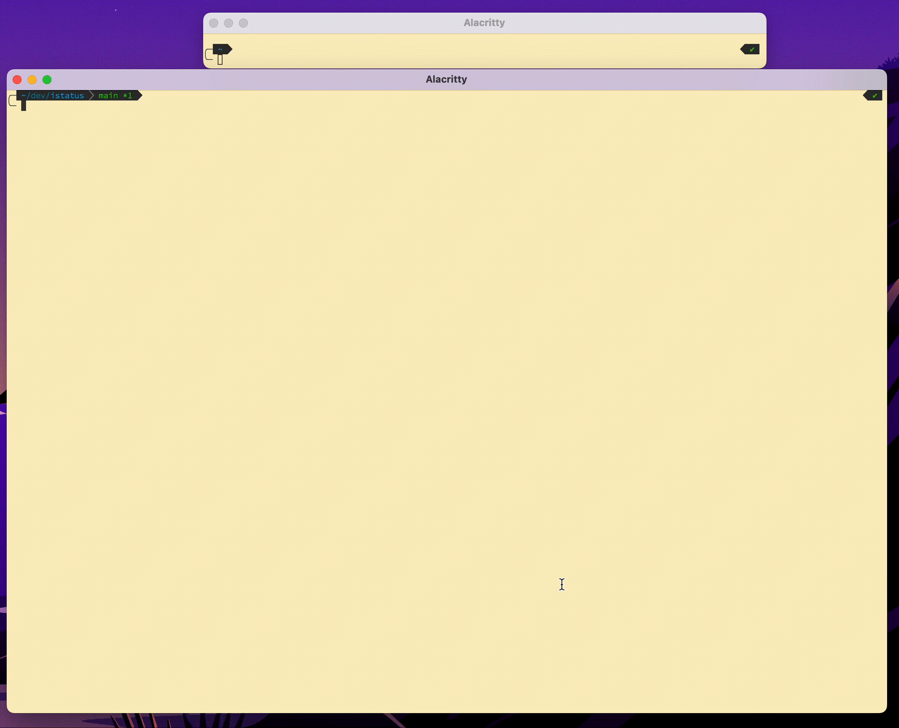

# DD Inspector

Like `agent status` but more `~~interactive~~`



```
# Coming soon!
# go install github.com/scottopell/ddinspector
```

## Features
- Discover a local running DataDog agent automatically
- Refresh data automatically to view live state


## Develop locally
```
go build -o ddinspector cmd/main.go
# Or use vscode integration for debugger
```

## Future Ideas/TODO
- Display DogStatsD Metric captures as a table instead of `TextView`
- In Dogstatsd capture display page, add pane to send dogstatsd messages as text to port 8125
- Basic keyboard shortcuts - `q` to quit, `gt`/`gT` to switch tabs, `?` to display keyboard shortcuts in modal
- 
