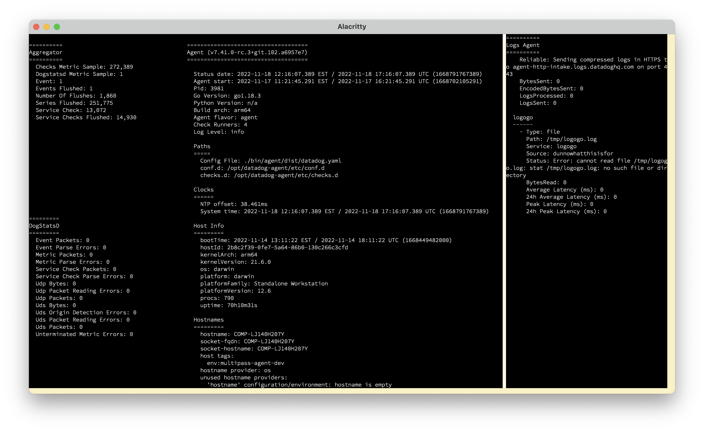

# IStatus

Like `agent status` but more `~~interactive~~`

## TODO
- [x] Fetch basic agent data
- [x] Display all `agent status` data in a useful way
- [x] Change run-time config options
- [x] Display DogStatsD Metric samples in a useful way

## Future Ideas/TODO
- Display DogStatsD Metric captures as a table instead of `TextView`
- In Dogstatsd capture display page, add pane to send dogstatsd messages as text to port 8125
- Basic keyboard shortcuts - `q` to quit, `gt`/`gT` to switch tabs, `?` to display keyboard shortcuts in modal
- 